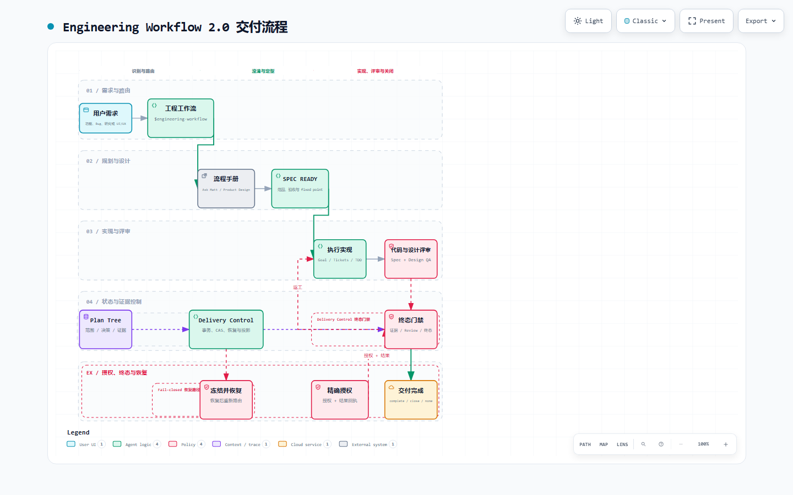

# Codex Engineering Workflow

一个面向 Codex 的完整工程交付工作流：从需求路由、澄清、规格、执行和评审，一直管理到证据闭环、权限确认与可恢复关闭。

它不是传统 Plan Mode 的替代品，而是将短期计划、长期计划树、具体工程流程和事务控制组合成一条可验证的交付链路。

## 工作流总览

下面是当前 `engineering-workflow 2.0` 的交付流程总览，展示从需求路由到终态门禁、授权和恢复的完整路径。

[](assets/engineering-workflow-v2-flowchart.html)

点击流程图可打开可交互版本，支持浅色/深色主题、路径查看和导出。

## 核心能力

- 自动判断直接实现、常规交付、复杂决策、UI/UX 和纯计划维护路线。
- 读取并应用 Ask Matt 的 procedure manual，完成澄清、spec、tickets、goal、TDD 和 review 等阶段。
- 以 Plan Tree 作为唯一持久业务权威，保存范围、决策、阶段、证据与恢复点。
- 通过 Delivery Control MCP 管理事务、CAS revision、lease、崩溃恢复、漂移检测和 native Plan 同步。
- 以结构化 evidence、terminal observation、Review disposition 和 terminal condition 作为完成门禁，阶段完成不等于交付完成。
- 对 commit、push、PR、merge、deploy、生产操作和外部通信采用精确、短期、单次授权。
- 通过高层入口隐藏普通流程中的 CAS、lease、Plan projection 和 evidence 事务细节。
- required phase 由统一策略控制：`spec` 只有在批准的 imported spec 下可跳过，`execute`/`review` 不可静默绕过；scope rework 会复用历史已完成阶段。
- 每次 scope revision 都创建新的 `delivery_generation` 和 fixed point；旧 spec、实现、Review 与 evidence 继续可审计，但不能关闭新一代交付。
- Review finding 按 ID 追加或更新，不能通过空列表清除；P0/P1 必须 `fixed` 且有 `reverified_by` 才能关闭。
- 授权同时保留外部动作 digest 与控制器 mutation digest，旧 SQLite schema 会自动迁移，事务备份保存在专用目录并限制保留数量。
- 外部动作把“已授权”和“已成功”分开验证：每次授权只允许一个结果，失败重试必须重新授权，并以本地回执 artifact/digest 证明结果。
- 路线策略、运行时常量、JSON Schema 与 workflow 引用由一个 canonical policy 生成，并由 drift check 阻止副本分叉。

## 组件关系

| 组件 | 职责 |
| --- | --- |
| `engineering-workflow` | 唯一日常入口；自动路由并推进完整交付流程 |
| [Ask Matt](https://github.com/tt-a1i/matt-skills-with-to-goal) | 提供具体工程 procedure manuals |
| [Plan Tree](https://github.com/SeemSeam/plan-tree) | 持久计划、范围、决策、状态、问题与证据的权威来源 |
| `delivery-control` | 本地事务、锁、恢复、证据、授权、指标和同步控制 |
| Product Design | 可选；处理 UI/UX 设计与设计 QA |

## 要求

- Codex Desktop 或支持 Skills 与本地 MCP 插件的 Codex 环境
- [Ask Matt](https://github.com/tt-a1i/matt-skills-with-to-goal)
- [Plan Tree](https://github.com/SeemSeam/plan-tree) `>= 0.4.0`
- Node.js 24（用于构建和运行 `delivery-control`）
- PowerShell 5 或 7（用于 workflow 验证脚本）
- Product Design（可选，只有 UI/UX 路线需要）

## 安装

### 1. 安装依赖 Skills

请先按各自仓库的说明安装 Ask Matt 与 Plan Tree。本仓库不复制或重新分发这两个项目。

### 2. 安装 Engineering Workflow

将 `skills/engineering-workflow` 复制到 Codex 的个人 Skills 目录：

```powershell
Copy-Item -Recurse -Force .\skills\engineering-workflow "$env:USERPROFILE\.codex\skills\engineering-workflow"
```

### 3. 构建并安装 Delivery Control

```powershell
Set-Location .\plugins\delivery-control
npm ci
npm run check
Set-Location ..\..
codex plugin marketplace add 1clipse/codex-engineering-workflow
codex plugin add delivery-control@codex-engineering-workflow
```

不同 Codex CLI 版本的插件命令可能略有差异，请以当前 Codex 插件文档和 `codex plugin --help` 为准。安装或升级插件后，新建一个 Codex 任务以加载新的 Skill 和 MCP 工具。

## 使用

日常功能、复杂 Bug、研究、架构或跨会话交付：

```text
$engineering-workflow 实现用户权限管理，并完成测试和评审
```

也可以直接用自然语言提出非简单工程任务，满足 Skill 触发条件时由 Codex 自动路由。

仅维护计划树时直接调用：

```text
$plan-tree 更新当前路线图和未决问题
```

需要审计、恢复、漂移诊断或检查终态门禁时：

```text
$delivery-control 审计当前 flow，检查漂移和未满足的验收项
```

普通交付优先使用这些高层 MCP 工具：

```text
start_or_resume_flow       # 初始化或恢复
select_route               # 选择控制器内置路线模板
advance_phase              # 按模板推进并生成 native Plan projection
revise_scope               # 新建交付代际并清空旧 fixed point
record_delivery_evidence  # 记录证据并返回当前门禁
record_review_findings     # 记录 Review disposition
record_external_action_result # 记录授权动作的成功或失败
close_flow                 # 通过全部门禁后关闭
```

## 验证

仓库内可独立运行的测试：

```powershell
powershell -NoProfile -ExecutionPolicy Bypass -File .\skills\engineering-workflow\scripts\test-state.ps1
powershell -NoProfile -ExecutionPolicy Bypass -File .\skills\engineering-workflow\scripts\test-upgrades.ps1
powershell -NoProfile -ExecutionPolicy Bypass -File .\skills\engineering-workflow\scripts\test-validate.ps1

Set-Location .\plugins\delivery-control
npm ci
npm run check
```

完整集成验证还会动态检查已安装的 28 个 Ask Matt Skills、Plan Tree、Product Design、全局 `AGENTS.md` 和 Delivery Control。安装全部依赖后，通过 `validate.ps1` 的 `SkillsRoot`、`AgentsFile`、`ProductDesignRoot` 和 `DeliveryPluginRoot` 参数传入实际路径；`test-validate.ps1` 提供同名的 `Source*` 参数用于故障注入测试。

## 数据与安全

`delivery-control` 通过本地 stdio MCP 运行，不监听网络端口。运行状态默认保存在 `~/.codex/state/delivery-control/delivery-control.sqlite`，不会包含在本仓库或插件升级包中。

Plan Tree 投影产生的恢复备份位于目标目录下的 `.delivery-control-backups/`，默认最多保留最近 5 份；SQLite schema 会在插件启动时执行受控迁移，不需要删除现有状态库。

控制器不会替用户执行 commit、push、PR、merge、deploy、生产变更或外部消息；它只记录并验证这些动作是否持有匹配的授权。外部动作的授权必须同时匹配 action、target、environment 和精确 request digest。它是交付协议控制层，不是 Codex 宿主级安全沙箱。

## 特别鸣谢 / Special Thanks

- [@tt-a1i](https://github.com/tt-a1i) 的 [matt-skills-with-to-goal](https://github.com/tt-a1i/matt-skills-with-to-goal)，为本工作流提供 Ask Matt 路由与工程 procedure manuals。
- [@mattpocock](https://github.com/mattpocock) 的 [mattpocock/skills](https://github.com/mattpocock/skills)，是 Ask Matt 项目标注的上游灵感与基础。
- [@SeemSeam](https://github.com/SeemSeam) 的 [plan-tree](https://github.com/SeemSeam/plan-tree)，为跨会话长期计划、决策、状态和证据管理提供基础。

这些上游项目彼此独立，也不隶属于本集成项目。请遵循各自仓库的许可证、使用条款和版本说明。

更完整的致谢与边界说明见 [ACKNOWLEDGEMENTS.md](ACKNOWLEDGEMENTS.md)。

## License

本仓库目前未附加开源许可证。公开可见不等于授予复制、修改或再分发权；上游依赖继续适用各自的许可证或权利声明。
